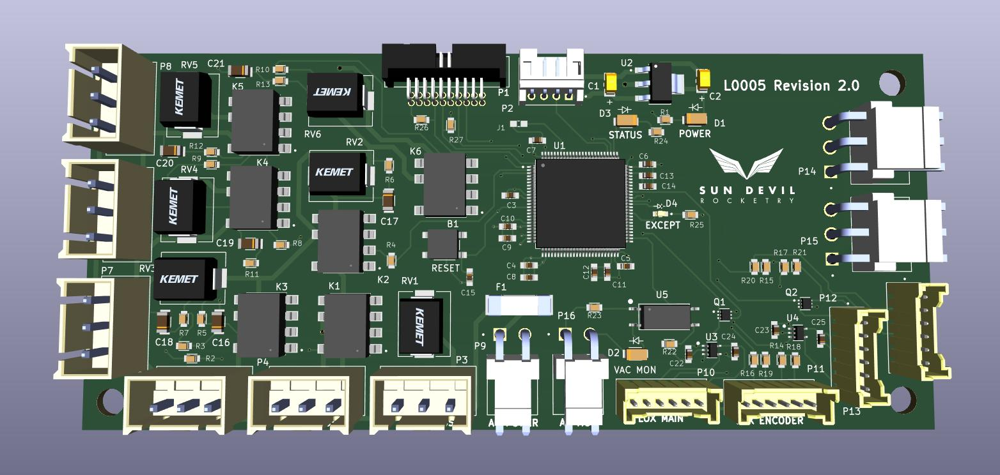
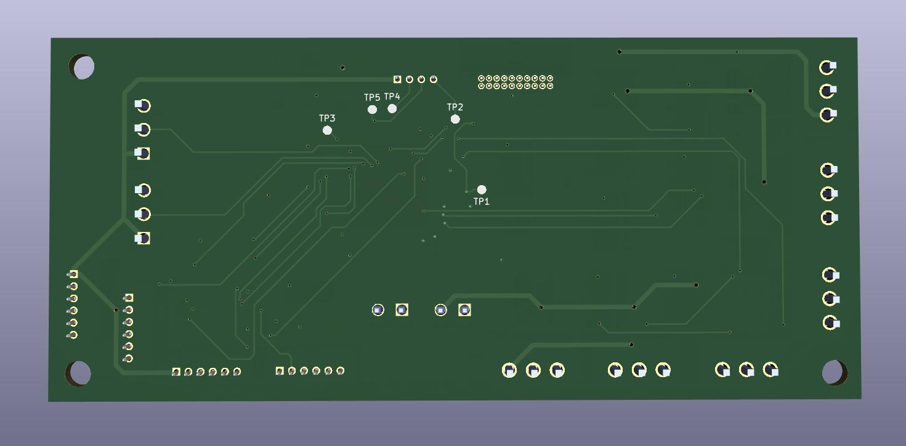
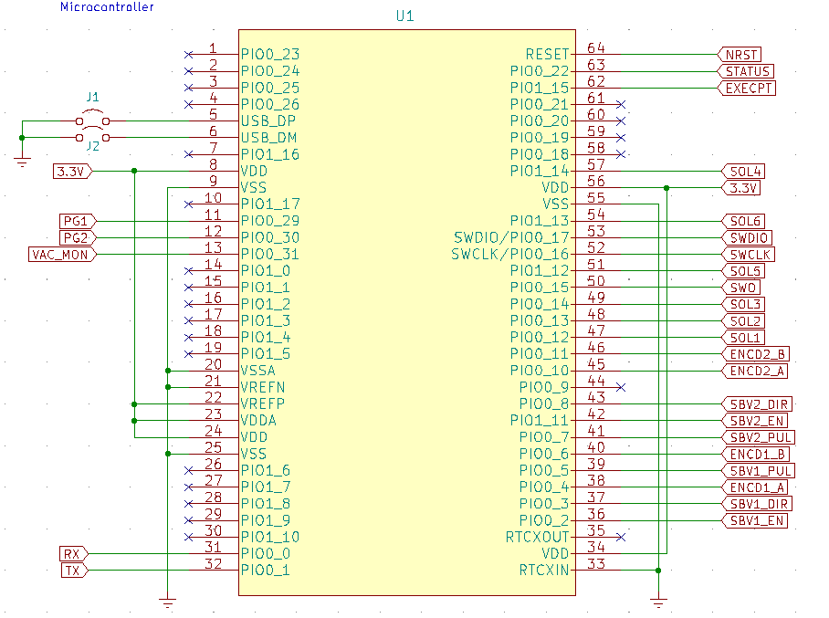
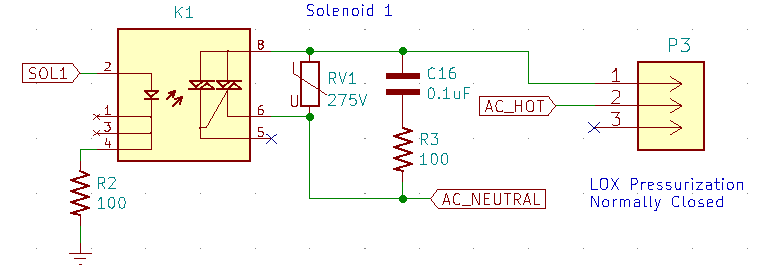
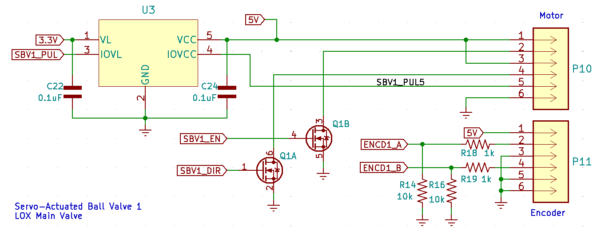

<h1>Valve Controller</h1>

PCB Revision: 1.0

PCB Part No: L0005

The liquid engine's valve controller (L0005) contains the processor responsible for managing valve actuation commands issued by the liquid engine controller (L0002). The board contains opto-isolated solid state relays for solenoid actuation and a Pulse Width Modulation interface for issuing stepper motor commands that initiate actuation of the liquid engine's main propellant valves. The board contains an NXP ARM Cortex-M4 microcontroller for processing, programmed using a J-Link with a 20-pin IDC cable connection. The board is powered from the 5V buck converter on L0002, which is also used to power the photogate sensors used for valve position calibration. In order to allow the controller to know the true actuation state of the solenoids even in the event of a power failure, the board contains an AC power supply monitoring circuit which produces an indication signal read by the MCU when AC power is available for solenoid actuation. 

<b>Working Directory Structure:</b>

   doc: documentation
   
   src: source design files, e.g. schematic and PCB layout files

   lib: libraries for schematic symbols and footprints

   production: files needed for pcb fabrication, e.g. gerbers, profile, drill file

   sim: simulation models/files 

   cad: 3d models
  
   img: images of circuit/footprints for github display 

<h2>3D Model: </h2>

<h2>Schematic: </h2>

<h3>Microcontroller:</h3>

<h3>Solenoids</h3>

<h3>Ball Valve PWM Interface</h3>

<h3>Photogates, LEDs, and Supply Monitoring</h3>

